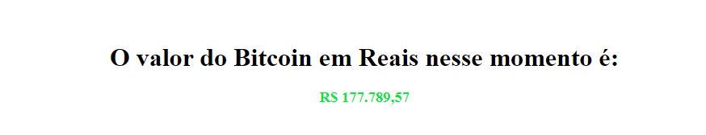

# Consulta Bitcoin

> Status: Concluido ⚠️

## Desafio proposto pelo curso de Javascript da Origamid

Construir uma aplicação que consome a API com valor do bitcoin e retorne o valor atual na cotaçao do real e atualize esse valor a cada 30 segundos utilizando FETCH API

## Tecnologias Usadas

| HTML | CSS | JAVASCRIPT |
| ---- | --- | ---------- |

## Link

[Consulta Bitcoin](https://consulta-bitcoin.vercel.app/)
